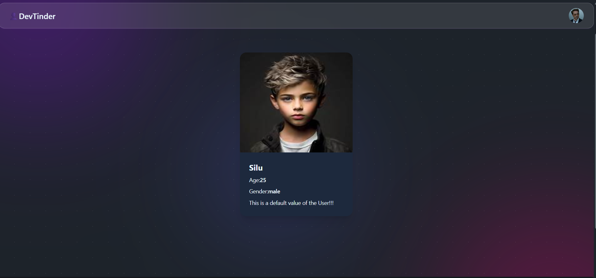

# 🚀 DevTinder Frontend

DevTinder is like a developer networking platform where developers can connect, view profiles, and build meaningful tech connections(inpiring from devTinder and build a liitelbit).

This repository contains the **Frontend** of the DevTinder application built using React and Redux.

---

## 🛠️ Tech Stack

- React.js
- Redux Toolkit
- React Router
- Axios
- Tailwind CSS
- Framer Motion
- react-hot-toast

---

## ✨ Features

- User Authentication (Login / Signup)
- Profile Page
- Developer Feed
- Send & Accept Connection Requests
- Fully Responsive UI
- JWT Authentication with httpOnly Cookies

---

### 🏠 Home / Feed Page

---
